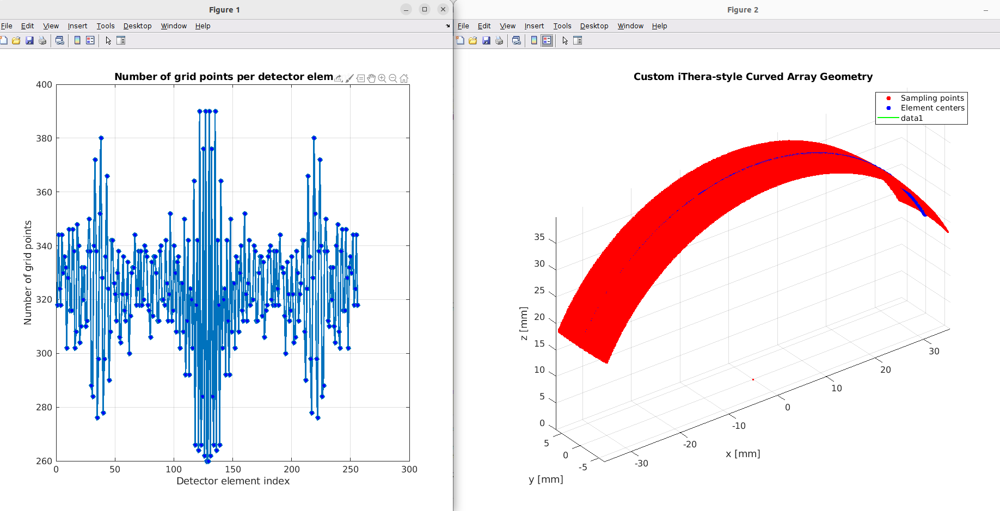

# iThera k-Wave Geometry

simulate_3D.m and ithera_geometry.m contain the modifications made by Jeremie at iThera to better represent the actual layout of the MSOT Acuity Echo Transducer.

kWave’s built-in array-element helpers (kWaveArray / addRect/addArc) were replaced with a custom geometry function (ithera_geometry) that builds a binary sensor mask and a mapping from k-grid points → physical detector elements, then averages the simulated point-sensor signals to produce one time trace per physical element.

Only relevant in the 3D case.

## Visualization

## Remarks
- k-waves addArcElement function seems to be only supported in the 2D case: http://www.k-wave.org/documentation/kWaveArray.php#:~:text=addArcElement